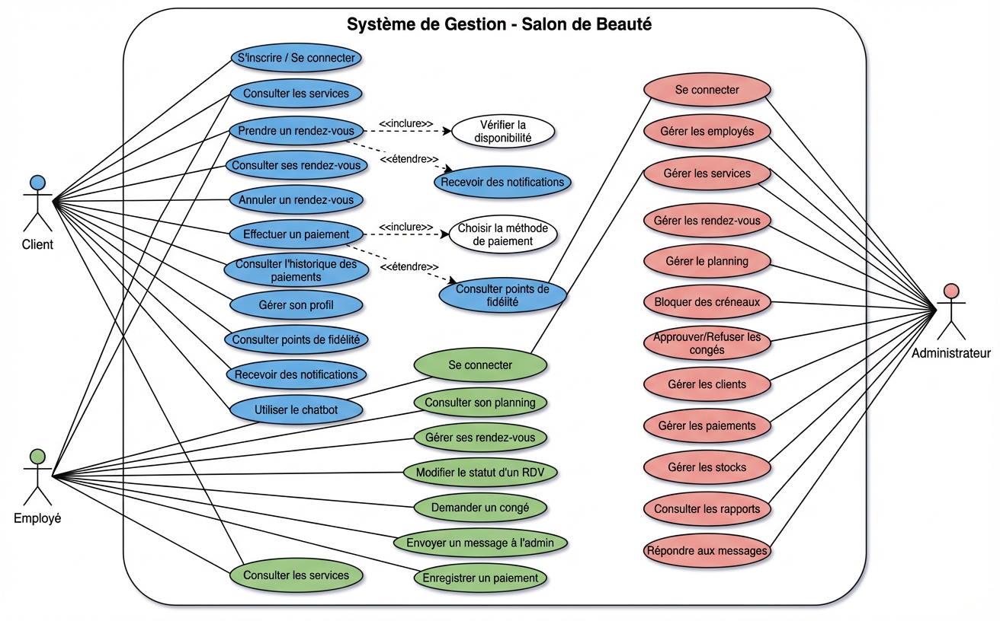
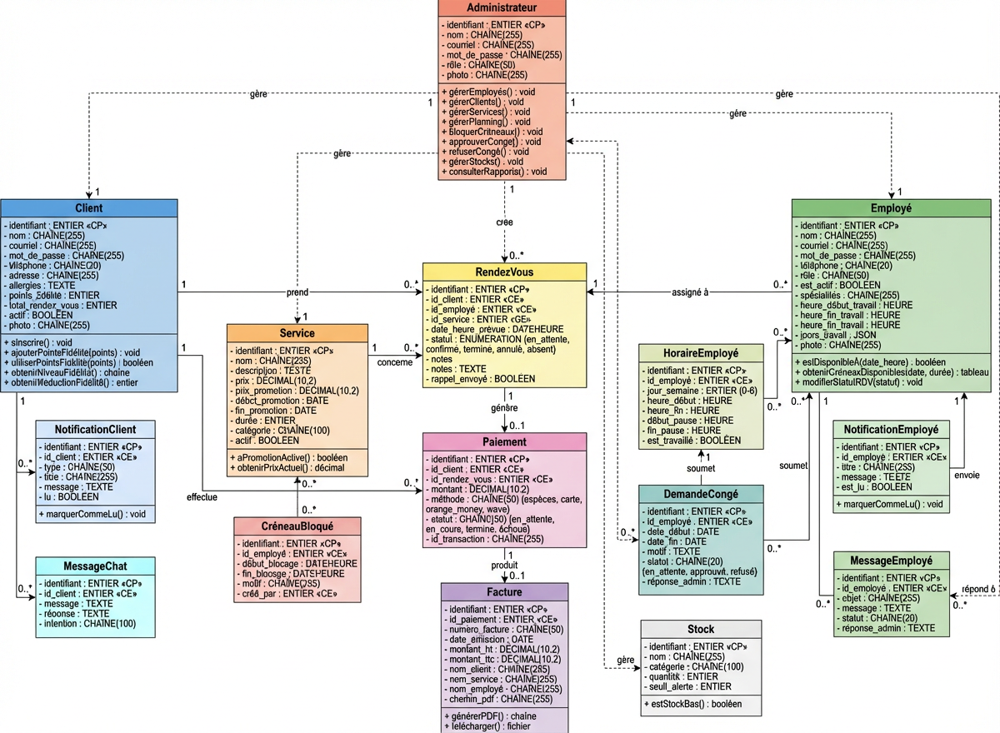
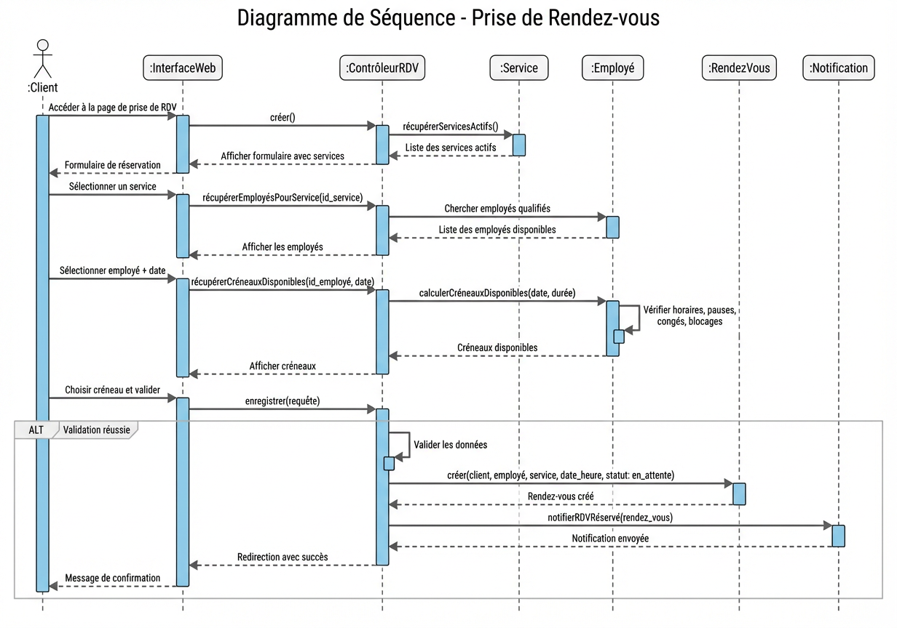
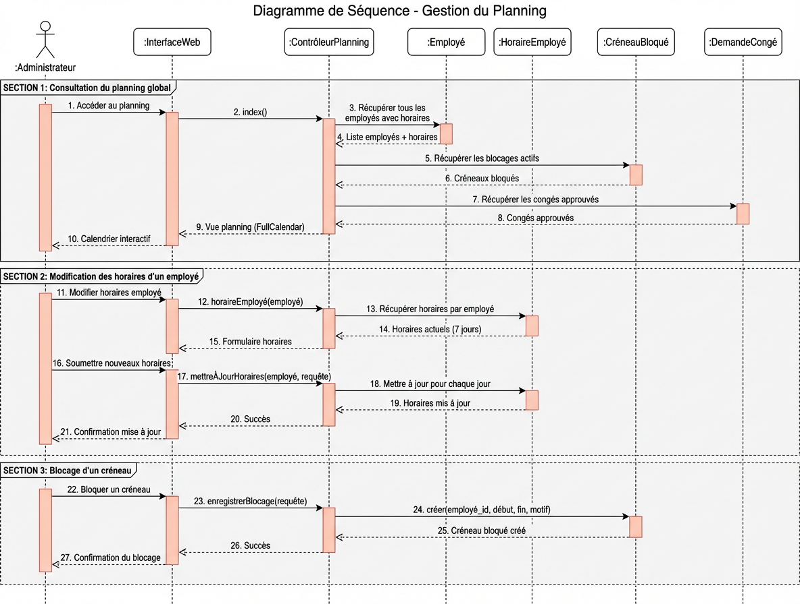
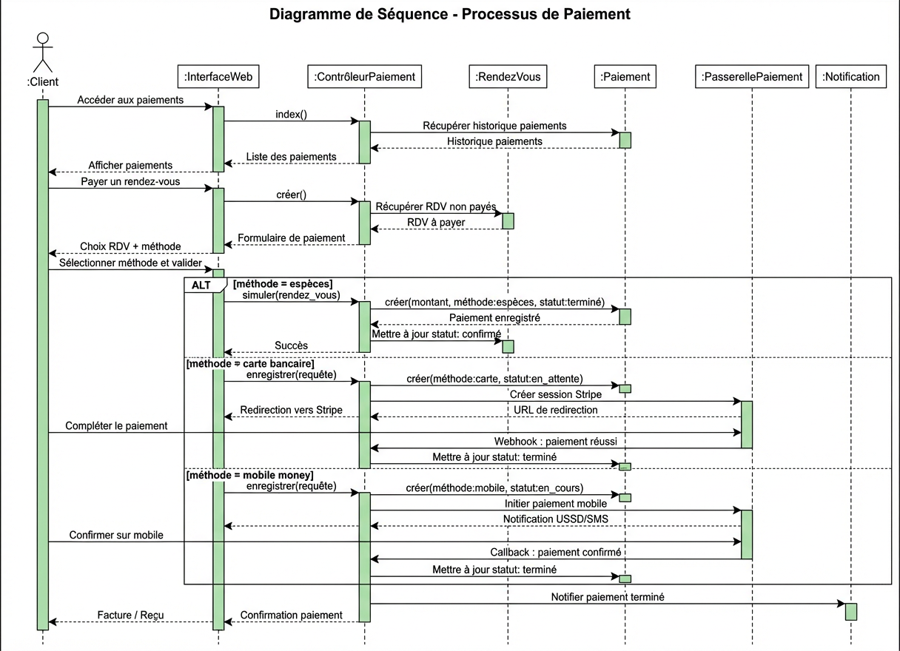
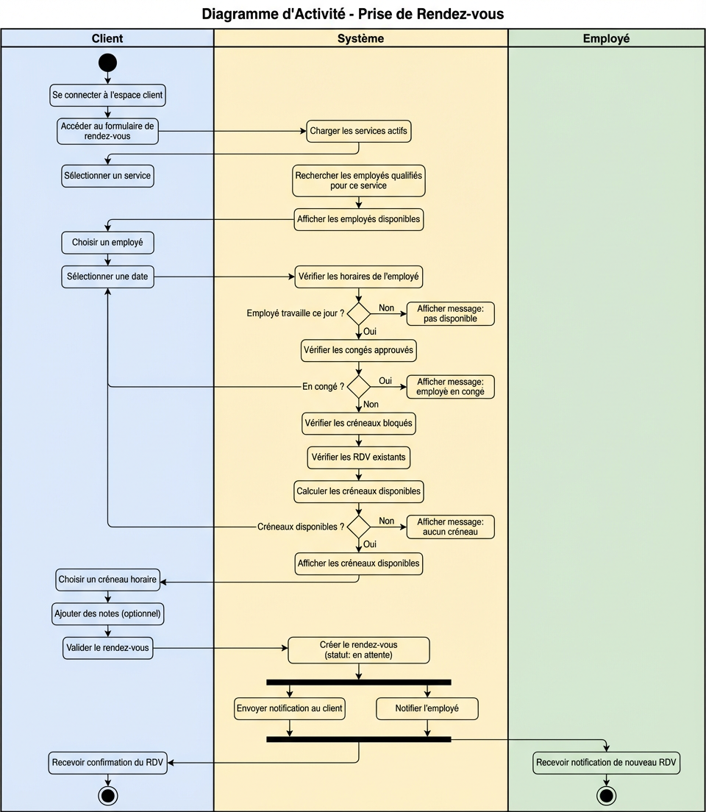
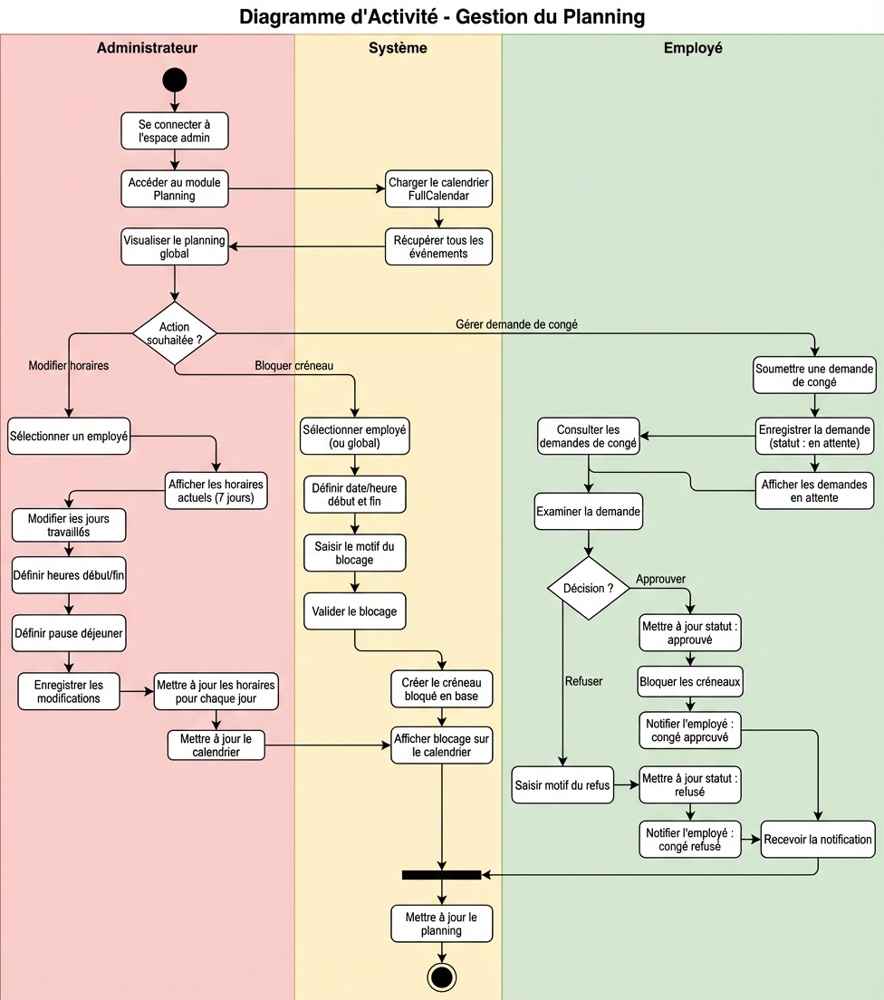
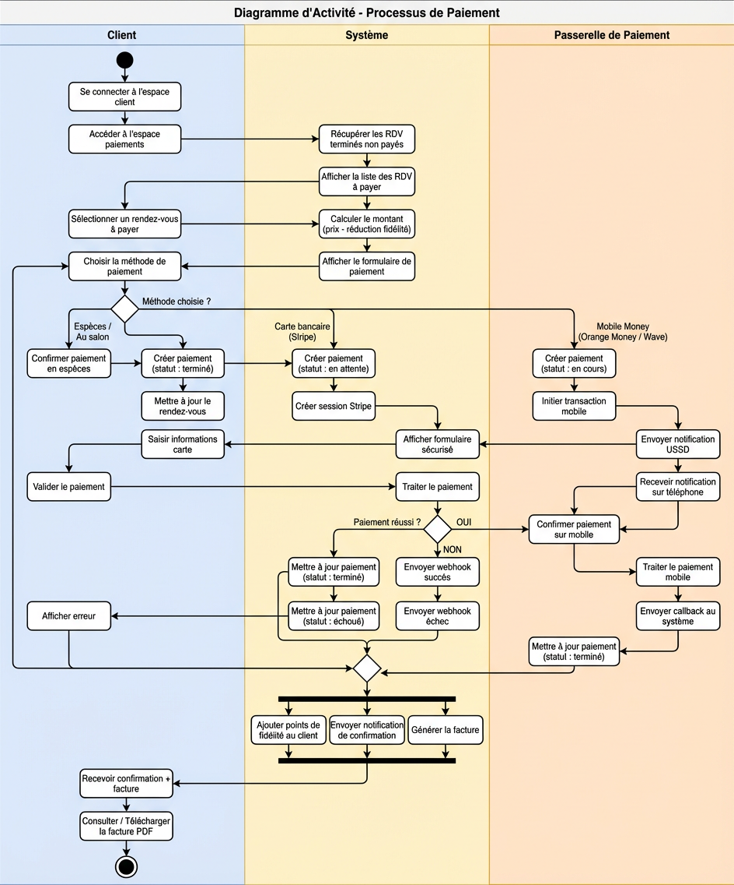

# 📐 Analyse UML - Système de Gestion de Salon de Beauté

## Table des matières

1. [Diagramme de Cas d'Utilisation](#1-diagramme-de-cas-dutilisation)
2. [Diagramme de Classes](#2-diagramme-de-classes)
3. [Diagrammes de Séquence](#3-diagrammes-de-séquence)
4. [Diagrammes d'Activité](#4-diagrammes-dactivité)

---

## 1. Diagramme de Cas d'Utilisation

### 1.1 Description générale

Le système identifie **trois acteurs principaux** :

| Acteur | Rôle | Guard d'authentification |
|--------|------|--------------------------|
| **Client** | Utilisateur final qui réserve des services | `auth:clients` |
| **Employé** | Personnel du salon qui réalise les prestations | `auth:employees` |
| **Admin** | Administrateur qui gère l'ensemble du salon | `auth:web` + middleware `admin` |

### 1.2 Cas d'utilisation par acteur

#### 🔵 Client
| # | Cas d'utilisation | Description |
|---|-------------------|-------------|
| CU-C01 | S'inscrire / Se connecter | Création de compte et authentification |
| CU-C02 | Consulter les services | Voir la liste des prestations avec prix et promotions |
| CU-C03 | Prendre un rendez-vous | Réserver un créneau avec un employé pour un service |
| CU-C04 | Consulter ses rendez-vous | Voir les RDV à venir et passés (calendrier + liste) |
| CU-C05 | Annuler un rendez-vous | Annuler un RDV en attente ou confirmé |
| CU-C06 | Effectuer un paiement | Payer via espèces, carte, Orange Money ou Wave |
| CU-C07 | Consulter l'historique des paiements | Voir les factures et reçus |
| CU-C08 | Gérer son profil | Modifier informations personnelles et photo |
| CU-C09 | Consulter points de fidélité | Voir son niveau (Bronze/Argent/Or/Platine) et réductions |
| CU-C10 | Recevoir des notifications | Rappels RDV, confirmations, promotions |
| CU-C11 | Utiliser le chatbot | Assistant conversationnel pour aide et informations |

#### 🟢 Employé
| # | Cas d'utilisation | Description |
|---|-------------------|-------------|
| CU-E01 | Se connecter | Authentification employé |
| CU-E02 | Consulter son planning | Voir horaires, RDV assignés, jours de repos |
| CU-E03 | Gérer ses rendez-vous | Voir la liste et le détail des RDV assignés |
| CU-E04 | Modifier statut RDV | Confirmer, terminer ou marquer absent |
| CU-E05 | Demander un congé | Soumettre une demande de congé à l'admin |
| CU-E06 | Envoyer message à l'admin | Communication interne avec l'administration |
| CU-E07 | Enregistrer un paiement | Saisir un paiement reçu au salon |
| CU-E08 | Consulter les services | Voir les prestations proposées par le salon |

#### 🔴 Admin
| # | Cas d'utilisation | Description |
|---|-------------------|-------------|
| CU-A01 | Se connecter | Authentification administrateur |
| CU-A02 | Gérer les employés (CRUD) | Créer, modifier, activer/désactiver les employés |
| CU-A03 | Gérer les services (CRUD) | Créer, modifier, gérer les promotions |
| CU-A04 | Gérer les rendez-vous | Créer, modifier, annuler les RDV de tous les clients |
| CU-A05 | Gérer le planning | Modifier horaires, visualiser calendrier global |
| CU-A06 | Bloquer des créneaux | Bloquer des plages horaires (par employé ou global) |
| CU-A07 | Approuver/Refuser congés | Traiter les demandes de congé des employés |
| CU-A08 | Gérer les clients | CRUD clients, activer/désactiver comptes |
| CU-A09 | Gérer les paiements | Consulter et modifier le statut des paiements |
| CU-A10 | Gérer les stocks | CRUD produits, alertes de stock bas |
| CU-A11 | Consulter rapports/statistiques | Tableau de bord, export CSV |
| CU-A12 | Répondre aux messages employés | Messagerie interne |

### 1.3 Relations entre cas d'utilisation

| Relation | Source | Cible | Type |
|----------|--------|-------|------|
| R1 | Prendre un rendez-vous | Consulter les services | `<<include>>` |
| R2 | Prendre un rendez-vous | Vérifier disponibilité | `<<include>>` |
| R3 | Effectuer un paiement | Sélectionner méthode de paiement | `<<include>>` |
| R4 | Bloquer des créneaux | Gérer le planning | `<<include>>` |
| R5 | Recevoir des notifications | Prendre un rendez-vous | `<<extend>>` |
| R6 | Consulter points de fidélité | Effectuer un paiement | `<<extend>>` |

### 1.4 Diagramme

---

## 2. Diagramme de Classes

### 2.1 Classes principales et leurs responsabilités

#### Correspondance Cas d'utilisation → Classes

| Cas d'utilisation | Classes impliquées |
|-------------------|--------------------|
| CU-C03 : Prendre un rendez-vous | Client, RendezVous, Service, Employé |
| CU-C06 : Effectuer un paiement | Client, Paiement, RendezVous |
| CU-C09 : Consulter points de fidélité | Client (points_fidélité) |
| CU-C11 : Utiliser le chatbot | Client, MessageChat |
| CU-E02 : Consulter son planning | Employé, HoraireEmployé |
| CU-E05 : Demander un congé | Employé, DemandeCongé |
| CU-E06 : Envoyer message à l'admin | Employé, MessageEmployé |
| CU-A02 : Gérer les employés | Administrateur → Employé |
| CU-A05 : Gérer le planning | Administrateur → HoraireEmployé |
| CU-A06 : Bloquer des créneaux | Administrateur → CréneauBloqué |
| CU-A07 : Approuver/Refuser congés | Administrateur → DemandeCongé |
| CU-A10 : Gérer les stocks | Administrateur → Stock |
| CU-A12 : Répondre aux messages | Administrateur → MessageEmployé |

#### Liste des classes

| Classe | Responsabilité | Table BDD |
|--------|---------------|-----------|
| `Administrateur` | Gère l'ensemble du salon (employés, clients, services, planning, stocks, congés, paiements, rapports) | `users` |
| `Client` | Client du salon (inscription, RDV, paiements, fidélité, chatbot) | `clients` |
| `Employé` | Personnel du salon (planning, RDV, congés, messages) | `employees` |
| `Service` | Service proposé par le salon (prix, promotions, durée) | `services` |
| `RendezVous` | Rendez-vous liant un client, un employé et un service | `appointments` |
| `Paiement` | Paiement associé à un rendez-vous | `payments` |
| `HoraireEmployé` | Horaire hebdomadaire d'un employé (7 jours) | `employee_schedules` |
| `CréneauBloqué` | Indisponibilité ponctuelle (par employé ou globale) | `blocked_slots` |
| `DemandeCongé` | Demande de congé soumise par un employé | `leave_requests` |
| `NotificationClient` | Notification destinée à un client | `client_notifications` |
| `NotificationEmployé` | Notification destinée à un employé | `employee_notifications` |
| `MessageChat` | Message du chatbot client | `chat_messages` |
| `MessageEmployé` | Message de l'employé vers l'administrateur | `employee_messages` |
| `Stock` | Produit en inventaire avec seuil d'alerte | `stocks` |
| `Paramètre` | Paramètres de configuration du salon | `settings` |

### 2.2 Relations entre classes

#### Relations de données (associations, traits pleins)

| Relation | Cardinalité | Libellé | Description |
|----------|-------------|---------|-------------|
| Client → RendezVous | 1 — 0..* | « prend » | Un client prend plusieurs rendez-vous |
| Employé → RendezVous | 1 — 0..* | « assigné à » | Un employé est assigné à plusieurs rendez-vous |
| Service → RendezVous | 1 — 0..* | « concerne » | Un service est utilisé dans plusieurs rendez-vous |
| RendezVous → Paiement | 1 — 0..1 | « génère » | Un rendez-vous génère au plus un paiement |
| Client → Paiement | 1 — 0..* | « effectue » | Un client effectue plusieurs paiements (relation directe via `client_id`) |
| Employé → HoraireEmployé | 1 — 0..* | « a pour horaire » | Un employé a un horaire par jour de la semaine |
| Employé → DemandeCongé | 1 — 0..* | « soumet » | Un employé soumet des demandes de congé |
| Employé ↔ Service | 0..* — 0..* | « qualifié pour » | Relation plusieurs-à-plusieurs (table pivot) |
| Client → NotificationClient | 1 — 0..* | « reçoit » | Un client reçoit des notifications |
| Employé → NotificationEmployé | 1 — 0..* | « reçoit » | Un employé reçoit des notifications |
| Client → MessageChat | 1 — 0..* | « utilise » | Un client utilise le chatbot |
| Employé → MessageEmployé | 1 — 0..* | « envoie » | Un employé envoie des messages à l'admin |
| Administrateur → CréneauBloqué | 1 — 0..* | « crée » | L'administrateur crée des créneaux bloqués |

#### Relations de gestion de l'Administrateur (traits pointillés)

| Relation | Libellé | Cas d'utilisation associé |
|----------|---------|--------------------------|
| Administrateur → Employé | « gère » | CU-A02 : Gérer les employés |
| Administrateur → Client | « gère » | CU-A08 : Gérer les clients |
| Administrateur → Service | « gère » | CU-A03 : Gérer les services |
| Administrateur → Stock | « gère » | CU-A10 : Gérer les stocks |
| Administrateur → DemandeCongé | « approuve/refuse » | CU-A07 : Approuver/Refuser congés |
| Administrateur → MessageEmployé | « répond à » | CU-A12 : Répondre aux messages |
| Administrateur → Paiement | « supervise » | CU-A09 : Gérer les paiements |

### 2.3 Diagramme

---

## 3. Diagrammes de Séquence

### 3.1 Prise de Rendez-vous

**Acteurs impliqués** : Client, Système (InterfaceWeb, AppointmentController, Models)

**Scénario principal** :
1. Le client accède au formulaire de prise de RDV
2. Le système charge les services actifs
3. Le client sélectionne un service
4. Le système recherche les employés qualifiés (via table pivot `employee_service`)
5. Le client choisit un employé et une date
6. Le système calcule les créneaux disponibles en vérifiant :
   - Les horaires de travail (`EmployeeSchedule`)
   - Les pauses
   - Les congés approuvés (`LeaveRequest`)
   - Les créneaux bloqués (`BlockedSlot`)
   - Les RDV existants (`Appointment`)
7. Le client choisit un créneau et valide
8. Le système crée le RDV (statut : `pending`)
9. Une notification est envoyée au client

---

### 3.2 Gestion du Planning

**Acteurs impliqués** : Admin, Système (ScheduleController, Models)

**Scénario principal** (3 sous-processus) :

**A. Consultation du planning global :**
1. L'admin accède au module planning
2. Le système charge le calendrier FullCalendar avec tous les événements
3. Affichage des RDV, congés approuvés et créneaux bloqués

**B. Modification des horaires d'un employé :**
1. L'admin sélectionne un employé
2. Le système affiche les horaires actuels (7 jours)
3. L'admin modifie les jours travaillés, heures début/fin, pauses
4. Le système utilise `updateOrCreate()` pour chaque jour

**C. Blocage d'un créneau :**
1. L'admin sélectionne un employé (ou blocage global)
2. Définition de la plage horaire et du motif
3. Le système crée un `BlockedSlot` en base

---

### 3.3 Processus de Paiement

**Acteurs impliqués** : Client, Système (PaymentController, Models), Passerelle de Paiement

**Scénario principal** avec 3 branches alternatives selon la méthode :

| Méthode | Flux | Statut initial → final |
|---------|------|------------------------|
| Espèces / Au salon | Paiement direct, enregistrement immédiat | `completed` |
| Carte Bancaire (Stripe) | Redirection vers Stripe, webhook de confirmation | `pending` → `completed` |
| Orange Money / Wave | Initiation mobile, notification USSD, callback | `processing` → `completed` |

**Après paiement réussi** :
- Points de fidélité ajoutés au client
- Notification de confirmation envoyée
- Facture générée (consultable et téléchargeable en PDF)

---

## 4. Diagrammes d'Activité

### 4.1 Prise de Rendez-vous

**Couloirs (Swim lanes)** : Client | Système | Employé

Ce diagramme montre le flux complet depuis la connexion du client jusqu'à la confirmation du RDV, en passant par toutes les vérifications de disponibilité du système (horaires, congés, blocages, RDV existants).

**Points de décision** :
- L'employé travaille-t-il ce jour ?
- L'employé est-il en congé ?
- Des créneaux sont-ils disponibles ?

**Activités parallèles** (fork/join) :
- Notification au client + Notification à l'employé

---

### 4.2 Gestion du Planning

**Couloirs (Swim lanes)** : Admin | Système | Employé

Ce diagramme illustre les trois actions principales de gestion du planning :
- **Branche A** : Modification des horaires d'un employé
- **Branche B** : Blocage d'un créneau horaire
- **Branche C** : Gestion des demandes de congé (approuver/refuser)

**Point de décision clé** : Approbation ou refus du congé, avec notification automatique à l'employé dans les deux cas.

---

### 4.3 Processus de Paiement

**Couloirs (Swim lanes)** : Client | Système | Passerelle de Paiement

Ce diagramme détaille les trois flux de paiement possibles :
- **Espèces / Au salon** : paiement immédiat sans passerelle externe
- **Carte Bancaire (Stripe)** : redirection, formulaire sécurisé, webhook
- **Mobile Money (Orange Money / Wave)** : notification USSD, confirmation sur téléphone, callback

**Activités parallèles finales** (fork/join) :
- Ajout de points de fidélité
- Envoi de notification de confirmation
- Génération de la facture PDF

---

## Récapitulatif des diagrammes

| # | Diagramme | Type | Fichier |
|---|-----------|------|---------|
| 1 | Cas d'utilisation | Cas d'utilisation | `diagrammes/01_diagramme_cas_utilisation.png` |
| 2 | Classes | Diagramme de classes | `diagrammes/02_diagramme_classes.png` |
| 3 | Séquence - Prise de RDV | Diagramme de séquence | `diagrammes/03_sequence_prise_rdv.png` |
| 4 | Séquence - Gestion Planning | Diagramme de séquence | `diagrammes/04_sequence_gestion_planning.png` |
| 5 | Séquence - Paiement | Diagramme de séquence | `diagrammes/05_sequence_paiement.png` |
| 6 | Activité - Prise de RDV | Diagramme d'activité | `diagrammes/06_activite_prise_rdv.png` |
| 7 | Activité - Gestion Planning | Diagramme d'activité | `diagrammes/07_activite_gestion_planning.png` |
| 8 | Activité - Processus de Paiement | Diagramme d'activité | `diagrammes/08_activite_paiement.png` |

---

*Analyse UML réalisée pour le projet de mémoire - Système de Gestion de Salon de Beauté*
*Développé par MINATOU - 2026*
